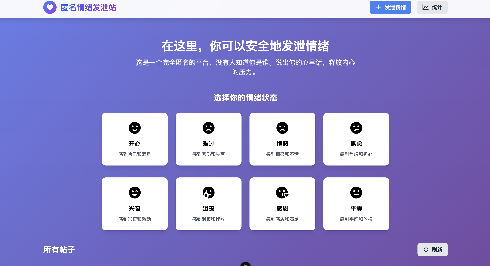
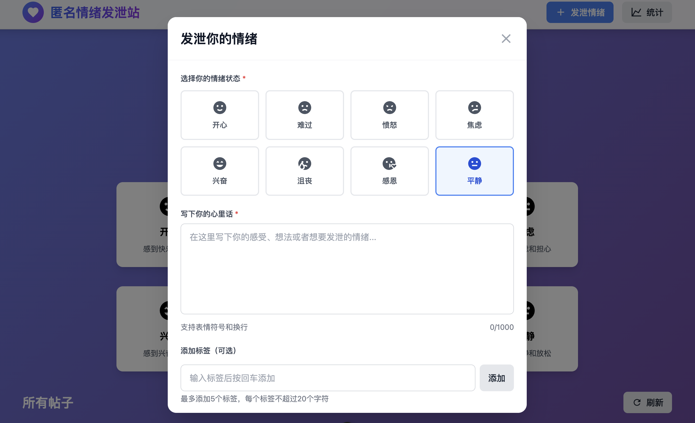
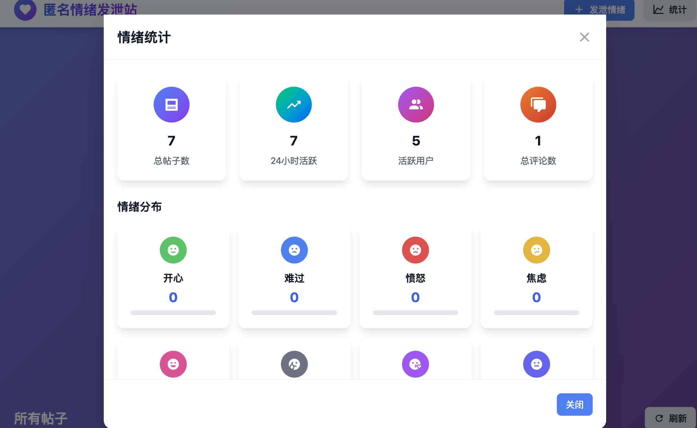
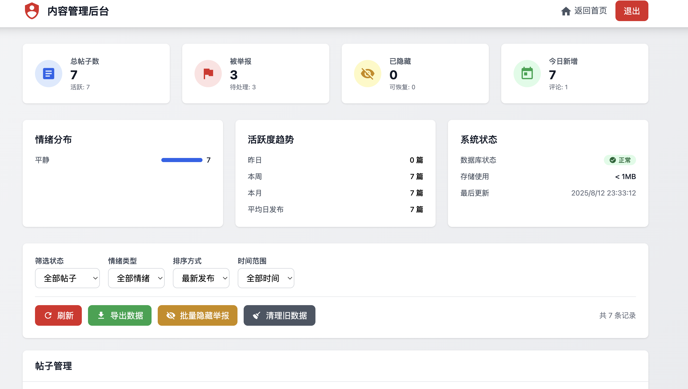

# 🎭 匿名情绪发泄站

> 一个安全、匿名的情绪发泄平台，让每个人都能自由表达内心感受

[](https://nuxt.com/)
[](https://vuejs.org/)
[](https://www.typescriptlang.org/)
[](https://unocss.dev/)
[](LICENSE)

一个基于 **Nuxt 3 + Vite + TypeScript + pnpm + UnoCSS** 搭建的现代化匿名情绪发泄网站。为用户提供一个安全、私密的情绪表达空间，支持多种情绪分类、匿名互动和数据分析功能。

## 📸 项目截图

### 🏠 主页界面

*现代化的渐变背景设计，情绪选择卡片清晰易用*

### 💭 发泄情绪弹窗

*简洁的情绪发泄界面，支持标签和匿名设置*

### 📊 统计面板

*详细的情绪分布和趋势分析*

### 💬 评论系统

*匿名评论功能，支持举报和审核*

### 🛡️ 管理后台

*完整的内容管理功能，支持举报处理和数据分析*

## 🚀 技术栈

- **前端框架**: [Nuxt 3](https://nuxt.com/) - 全栈Vue框架
- **构建工具**: [Vite](https://vitejs.dev/) - 快速构建工具
- **开发语言**: [TypeScript](https://www.typescriptlang.org/) - 类型安全
- **包管理器**: [pnpm](https://pnpm.io/) - 快速、节省磁盘空间
- **CSS框架**: [UnoCSS](https://unocss.dev/) - 原子化CSS引擎
- **图标库**: [Iconify](https://iconify.design/) - 统一图标解决方案
- **UI组件**: [Vue 3 Composition API](https://vuejs.org/) - 现代Vue开发模式
- **数据库**: [Prisma](https://www.prisma.io/) + SQLite - 类型安全数据库
- **部署**: [Docker](https://www.docker.com/) - 容器化部署

## ✨ 功能特性

### 🎭 情绪管理
- **8种情绪状态**: 开心、难过、愤怒、焦虑、兴奋、沮丧、感恩、平静
- **智能情绪选择**: 首页选择情绪后，弹窗自动同步预选
- **情绪可视化**: 直观的情绪图标和色彩表达

### 🔒 隐私保护
- **完全匿名**: 不收集任何个人信息，保护用户隐私
- **内容加密**: 敏感信息本地存储，不上传服务器
- **举报机制**: 支持内容举报，维护平台安全

### 📝 内容发布
- **情绪发泄**: 支持长文本输入（最多1000字）
- **标签系统**: 可添加最多5个标签，便于分类
- **匿名设置**: 可选择匿名或显示昵称发布

### 💬 社区互动
- **点赞功能**: 支持匿名点赞，增加互动性
- **评论系统**: 完全匿名的评论功能
- **内容分享**: 支持内容分享和传播

### 📊 数据分析
- **情绪统计**: 实时情绪分布和趋势分析
- **热门标签**: 标签使用频率排行
- **用户活跃度**: 发布和互动数据统计

### 🛡️ 管理功能
- **内容审核**: 举报内容自动标记和审核
- **批量操作**: 支持批量隐藏和删除违规内容
- **数据导出**: 支持数据导出和分析
- **系统监控**: 健康检查和性能监控

### 🎨 用户体验
- **响应式设计**: 完美适配各种设备尺寸
- **现代UI**: 渐变背景和卡片式布局
- **流畅动画**: 平滑的过渡和交互效果
- **无障碍设计**: 支持键盘导航和屏幕阅读器

## 🛠️ 安装和运行

### 环境要求

- **Node.js**: 18.0.0 或更高版本
- **pnpm**: 8.0.0 或更高版本
- **数据库**: SQLite (内置) 或 PostgreSQL (可选)

### 🚀 快速开始

#### 方法一：本地开发

```bash
# 克隆项目
git clone <your-repo-url>
cd octopus-emotion

# 安装依赖
pnpm install

# 启动开发服务器
pnpm run dev

# 访问应用
open http://localhost:3000
```

#### 方法二：Docker部署 (推荐)

```bash
# 克隆项目
git clone <your-repo-url>
cd octopus-emotion

# 配置环境变量
cp .env.example .env.production
# 编辑 .env.production 文件

# 使用部署脚本
chmod +x deploy.sh
./deploy.sh start

# 访问应用
open http://localhost:3000
```

### 📦 构建和部署

```bash
# 构建生产版本
pnpm run build

# 预览生产版本
pnpm run preview

# Docker构建
docker-compose build

# Docker部署
docker-compose up -d
```

### 🔧 环境配置

创建 `.env` 文件并配置以下环境变量：

```bash
# 数据库配置
DATABASE_URL="file:./prisma/dev.db"

# JWT配置
JWT_SECRET="your-secret-key"

# 管理员配置
ADMIN_PASSWORD="admin123"

# 应用配置
NUXT_HOST="0.0.0.0"
NUXT_PORT="3000"
```

## 📁 项目结构

```
octopus-emotion/
├── 📄 应用文件
│   ├── app.vue                    # 主应用页面
│   ├── pages/                     # 页面目录
│   │   ├── index.vue             # 主页
│   │   └── admin.vue             # 管理后台
│   └── components/                # 组件目录
│       ├── CreatePostModal.vue    # 创建帖子模态框
│       ├── StatsModal.vue         # 统计信息模态框
│       ├── CommentsModal.vue      # 评论模态框
│       └── ReportModal.vue        # 举报模态框
│
├── 🔧 配置文件
│   ├── nuxt.config.ts            # Nuxt主配置
│   ├── nuxt.config.prod.ts       # 生产环境配置
│   ├── uno.config.ts             # UnoCSS配置
│   ├── tailwind.config.js        # Tailwind配置
│   └── tsconfig.json             # TypeScript配置
│
├── 🗄️ 后端API
│   ├── server/                    # 服务端代码
│   │   ├── api/                  # API路由
│   │   │   ├── posts/            # 帖子相关API
│   │   │   ├── comments/         # 评论相关API
│   │   │   ├── admin/            # 管理后台API
│   │   │   └── health.get.ts     # 健康检查API
│   │   └── prisma/               # 数据库配置
│   └── prisma/                   # Prisma配置
│       ├── schema.prisma         # 数据库模式
│       └── migrations/           # 数据库迁移
│
├── 🎨 样式资源
│   ├── assets/                   # 静态资源
│   │   └── css/                  # CSS样式文件
│   │       └── main.css          # 主样式文件
│   └── types/                    # TypeScript类型定义
│       └── emotion.ts            # 情绪相关类型
│
├── 🐳 Docker部署
│   ├── Dockerfile                # Docker镜像构建
│   ├── docker-compose.yml        # 服务编排配置
│   ├── .dockerignore             # Docker构建忽略
│   ├── deploy.sh                 # 部署脚本
│   └── DOCKER_README.md          # Docker部署文档
│
└── 📚 文档
    ├── README.md                 # 项目说明文档
    └── docs/                     # 详细文档目录
        └── images/               # 项目截图
```

## 🎯 核心功能说明

### 1. 情绪发泄
- 用户可以选择当前情绪状态
- 支持长文本输入（最多1000字）
- 可添加最多5个标签
- 完全匿名发布

### 2. 隐私保护
- 不收集任何个人信息
- 所有内容完全匿名
- 支持匿名评论
- 内容仅用于情绪发泄

### 3. 社区互动
- 支持点赞功能
- 匿名评论系统
- 内容分享功能
- 情绪筛选和搜索

### 4. 数据统计
- 情绪分布统计
- 热门标签排行
- 发布趋势分析
- 活跃用户统计

## 🎨 设计特色

- **渐变背景**: 采用蓝紫粉渐变，营造温暖氛围
- **卡片式布局**: 清晰的信息层次，易于阅读
- **情绪图标**: 直观的情绪表达，增强用户体验
- **响应式设计**: 适配各种设备尺寸
- **动画效果**: 平滑的过渡动画，提升交互体验

## 🔧 自定义配置

### UnoCSS配置
在 `uno.config.ts` 中可以自定义：
- **预设配置**: presetUno, presetAttributify, presetIcons
- **快捷方式**: 自定义CSS类组合
- **主题色彩**: 自定义颜色变量
- **图标集合**: MDI, Tabler等图标库

### 样式定制
在 `assets/css/main.css` 中可以：
- **全局样式**: 修改基础样式和变量
- **组件样式**: 自定义组件外观
- **动画效果**: 添加过渡和动画
- **响应式**: 调整断点和布局

### 数据库配置
在 `prisma/schema.prisma` 中可以：
- **数据模型**: 定义帖子和评论结构
- **关系配置**: 设置模型间关联
- **索引优化**: 提升查询性能
- **迁移管理**: 版本控制和回滚

## ⚡ 性能优化

### 前端优化
- **代码分割**: 按需加载组件和页面
- **图片优化**: 使用WebP格式和懒加载
- **缓存策略**: 静态资源长期缓存
- **压缩优化**: Gzip压缩和代码压缩

### 后端优化
- **数据库索引**: 优化查询性能
- **连接池**: 管理数据库连接
- **缓存机制**: Redis缓存热点数据
- **负载均衡**: 多实例部署

### 部署优化
- **CDN加速**: 静态资源全球分发
- **容器优化**: 多阶段构建减小镜像
- **监控告警**: 实时性能监控
- **自动扩缩容**: 根据负载自动调整

## 🛠️ 开发指南

### 开发环境设置
```bash
# 安装依赖
pnpm install

# 启动开发服务器
pnpm run dev

# 类型检查
pnpm run type-check

# 代码格式化
pnpm run format

# 代码检查
pnpm run lint
```

### 代码规范
- **TypeScript**: 严格类型检查
- **ESLint**: 代码质量检查
- **Prettier**: 代码格式化
- **Husky**: Git钩子检查

### 测试策略
- **单元测试**: 组件和函数测试
- **集成测试**: API接口测试
- **E2E测试**: 端到端用户流程测试
- **性能测试**: 负载和压力测试

## 🚀 部署说明

### 🐳 Docker部署 (推荐)

#### 快速部署
```bash
# 使用部署脚本
./deploy.sh start

# 手动部署
docker-compose up -d
```

#### 环境配置
```bash
# 生产环境配置
cp .env.example .env.production
# 编辑 .env.production 文件

# 关键配置项
NODE_ENV=production
DATABASE_URL=file:/app/prisma/prod.db
JWT_SECRET=your-very-secure-jwt-secret-key
ADMIN_PASSWORD=your-secure-admin-password
```

#### 部署命令
```bash
./deploy.sh [command]

可用命令:
  build   - 构建 Docker 镜像
  start   - 启动服务 (默认)
  stop    - 停止服务
  restart - 重启服务
  logs    - 查看服务日志
  clean   - 清理所有 Docker 资源
  health  - 检查服务健康状态
```

### 🌐 传统部署

#### 静态部署
```bash
pnpm run build
# 将 .output/public 目录部署到静态服务器
```

#### 服务器部署
```bash
pnpm run build
# 将整个项目部署到支持 Node.js 的服务器
```

## 📚 API文档

### 🔐 认证API
- `POST /api/admin/login` - 管理员登录
- `GET /api/admin/stats` - 获取统计数据
- `GET /api/admin/posts` - 获取帖子列表

### 📝 内容API
- `GET /api/posts` - 获取帖子列表
- `POST /api/posts` - 创建新帖子
- `PUT /api/posts/:id/like` - 点赞帖子
- `DELETE /api/posts/:id` - 删除帖子

### 💬 评论API
- `GET /api/posts/:id/comments` - 获取评论列表
- `POST /api/posts/:id/comments` - 创建评论
- `DELETE /api/comments/:id` - 删除评论

### 🚩 举报API
- `POST /api/posts/:id/report` - 举报帖子
- `POST /api/comments/:id/report` - 举报评论

### 🏥 健康检查
- `GET /api/health` - 服务健康状态

## 🤝 贡献指南

我们欢迎所有形式的贡献！无论是代码、文档、设计还是想法。

### 贡献方式

1. **Fork 项目** - 点击右上角的Fork按钮
2. **创建功能分支** - `git checkout -b feature/amazing-feature`
3. **提交更改** - `git commit -m 'Add amazing feature'`
4. **推送到分支** - `git push origin feature/amazing-feature`
5. **创建 Pull Request** - 描述你的改进和变更

### 贡献类型

- 🐛 **Bug修复**: 报告和修复问题
- ✨ **新功能**: 添加新功能或改进
- 📚 **文档**: 改进文档和示例
- 🎨 **设计**: 改进UI/UX设计
- 🧪 **测试**: 添加或改进测试
- 🔧 **工具**: 改进开发工具和流程

### 开发流程

```bash
# 克隆你的fork
git clone https://github.com/your-username/octopus-emotion.git

# 添加上游仓库
git remote add upstream https://github.com/original-owner/octopus-emotion.git

# 同步最新代码
git fetch upstream
git checkout main
git merge upstream/main
```

## 📄 许可证

本项目采用 [MIT 许可证](LICENSE)。

**MIT许可证特点**:
- ✅ 允许商业使用
- ✅ 允许修改和分发
- ✅ 允许私人使用
- ✅ 仅要求保留版权声明

## 🙏 致谢

感谢所有为这个项目做出贡献的开发者和用户！

### 特别感谢
- [Nuxt.js](https://nuxt.com/) - 优秀的全栈Vue框架
- [UnoCSS](https://unocss.dev/) - 原子化CSS引擎
- [Prisma](https://www.prisma.io/) - 类型安全数据库工具
- [Iconify](https://iconify.design/) - 统一图标解决方案

### 贡献者

<a href="https://github.com/your-username/octopus-emotion/graphs/contributors">
  
</a>

## 📞 联系我们

- **项目主页**: [GitHub Repository](https://github.com/your-username/octopus-emotion)
- **问题反馈**: [Issues](https://github.com/your-username/octopus-emotion/issues)
- **功能建议**: [Discussions](https://github.com/your-username/octopus-emotion/discussions)
- **邮箱**: your-email@example.com

## 🔮 未来规划

- [ ] 移动端APP开发
- [ ] 多语言支持
- [ ] 实时聊天功能
- [ ] AI情绪分析
- [ ] 社区管理工具
- [ ] 数据导出功能
- [ ] 第三方登录
- [ ] 推送通知

---

**⚠️ 重要提醒**: 这是一个功能完整的项目，包含内容审核、用户举报、管理后台等安全功能。部署到生产环境前，请务必：
1. 修改所有默认密码和密钥
2. 配置适当的安全策略
3. 设置内容审核规则
4. 配置监控和告警
5. 定期备份数据
